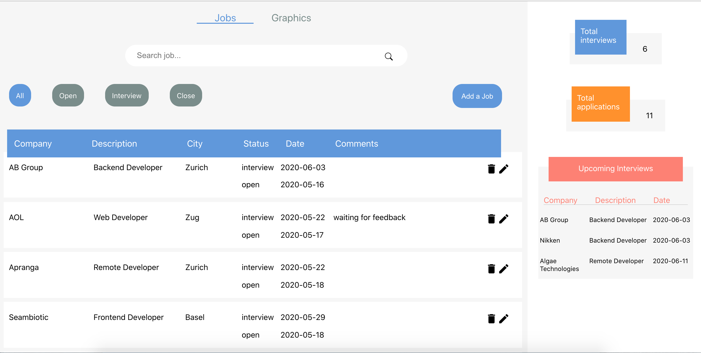
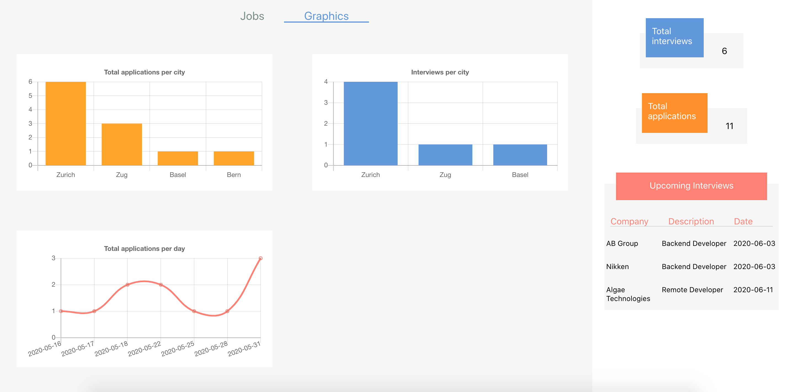
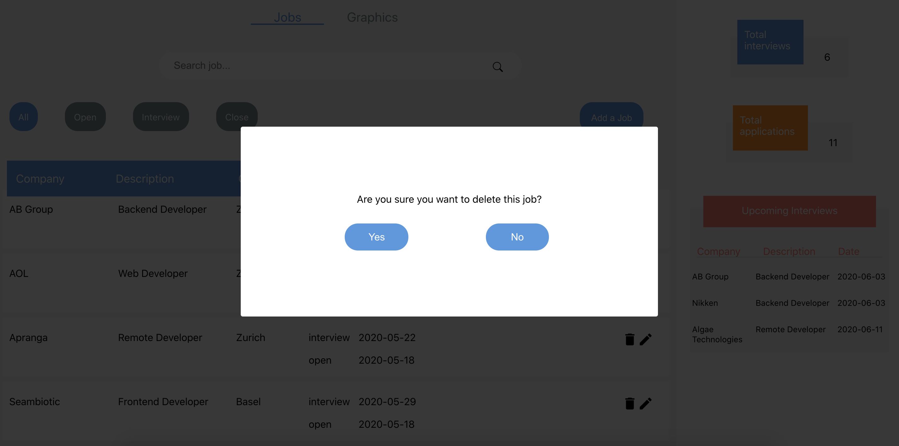
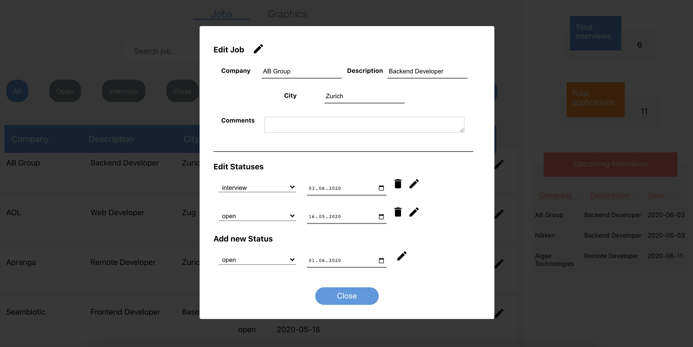
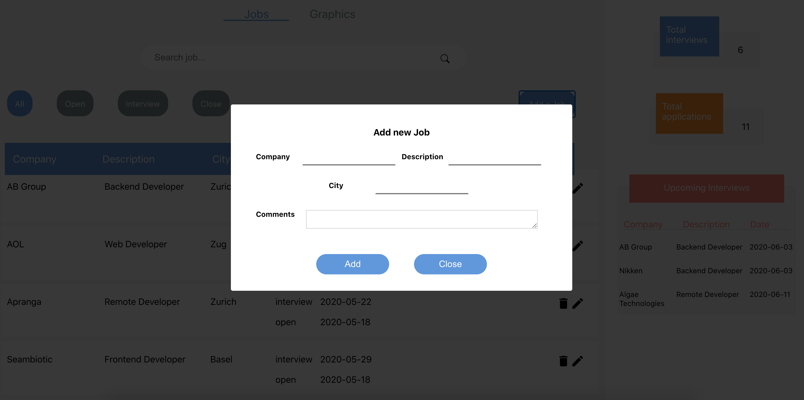

# JobTracker

## Description
Dashboard with a menu where user can select to see jobs or graphics.

	1) User can filter jobs by status, user can also search for a job by company name or description. 
     A job can be edited, deleted and new jobs can be added.
  2) Graphics show the total jobs/interviews per city and the evolution of applications during time.
  
The dashboard has a side bar with interactive cards to inform about the upcoming interviews, and other features.

### The app was build with Django for the backend and React for frontend, with Redux, Route, Typescript, test cases and docker.

## RUN THIS APP WITH:
 1. Install docker  https://docs.docker.com/docker-for-mac/install/
 2. Clone the repository with ->  git@github.com:jgibbons3/JobTracker.git
 3. docker-compose up 
 4. Check your local host ->   http://localhost:3000/ 
 
  
 
 
 
 
 
 
 
 
 
